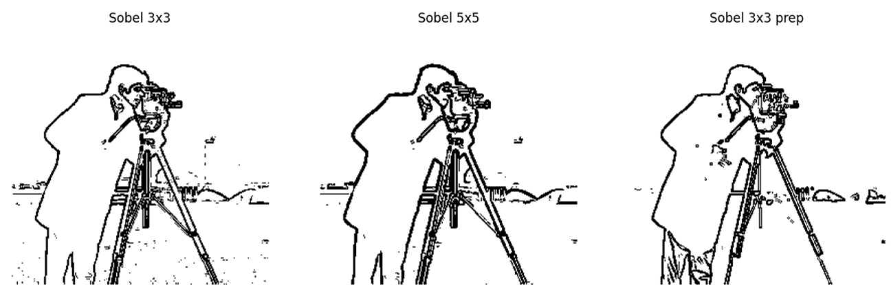

# Image-Processing-Algorithms-CV

## Description
The primary goal of this project is to implement fundamental Image Processing and Computer Vision (CV) algorithms from scratch in Python, avoiding "black-box" CV libraries to deeply understand the underlying matrix mathematics and convolution operations. The project provides a programmatic pipeline to enhance image contrast, manipulate intensity histograms, and detect edges using custom convolution kernels (Sobel operators), demonstrating how raw pixel data can be mathematically transformed to extract meaningful features.

### Algorithm Architecture & Features
The project is divided into two core analytical modules applied to standard grayscale images (e.g., `cameraman.tif`):
* **Module 1: Intensity Transformations**
  * *Logarithmic Transformation:* Enhances dark regions of an image by compressing higher pixel intensities and expanding lower ones.
  * *Linear Contrast Stretching:* Normalizes pixel values across the full [0, 255] spectrum.
  * *Piecewise-Linear Transformation (Preparation):* Dynamically adjusts specific intensity ranges based on user-defined inflection points ($x_1, x_2$) derived from histogram analysis, effectively isolating subjects from noisy backgrounds.
* **Module 2: Edge Detection & Convolution**
  * *Sobel Operator [3x3] & [5x5]:* Implements custom matrix convolution to calculate image intensity gradients ($G_x, G_y$). Demonstrates the trade-off between the high-frequency detail of a 3x3 kernel and the noise-suppressing smoothing of a 5x5 kernel.
  * *Binary Thresholding & Inversion:* Converts the gradient magnitude maps into crisp, binary edge representations, highlighting clear boundaries.

### Technologies Used
* **Python** — core programming language.
* **NumPy** — heavily utilized for efficient 2D array manipulation, matrix mathematics, and applying the convolution formulas.
* **SciPy (`scipy.signal.convolve2d`)** — used strictly for the mathematical application of the custom-defined Sobel kernels to the image matrices.
* **Pillow (PIL)** — used for basic file I/O operations (loading the `.tif` image and converting it to grayscale).
* **Matplotlib** — applied for plotting intensity histograms and visually comparing the original, intermediate, and final processed images side-by-side.

### Results
The scripts successfully process raw image matrices, applying sequential mathematical transformations. The results demonstrate that preprocessing an image (using piecewise-linear stretching) significantly improves the performance of edge detection algorithms like Sobel. The output correctly identifies object boundaries, effectively suppressing background noise and producing clean, binary edge maps without relying on high-level CV library functions.

### Visualization

<p align="center">
  <b>Intensity Transformation</b><br><br>
  <br><br>
  <sub>Original vs. Prepared image</sub>
</p>

<p align="center">
  <b>Edge Detection (Sobel)</b><br><br>
  <br><br>
  <sub>Binary edge map generated using custom 3x3 and 5x5 kernels</sub>
</p>

## Quick Start Guide

### 1. Download the Files
Clone or download the repository, ensuring you have the Python scripts (`Image-Processing-Algorithm-1.py`, `Image-Processing-Algorithm-2.py`) and your test image (`cameraman.tif`).

### 2. Install Dependencies
The scripts require standard scientific Python libraries. Ensure you have Python 3.8+ installed, then run:
```bash
pip install numpy scipy matplotlib pillow
```
### 3. 
